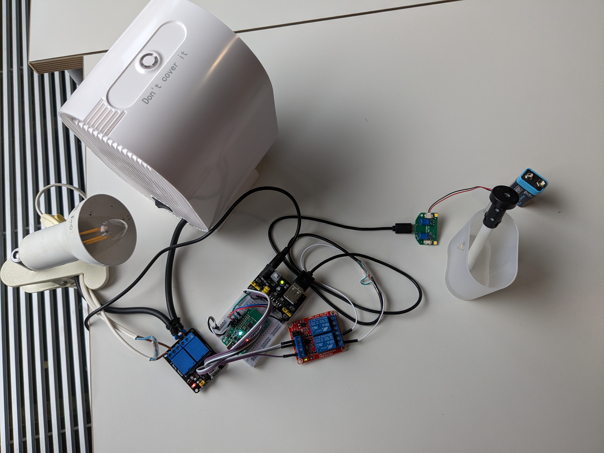
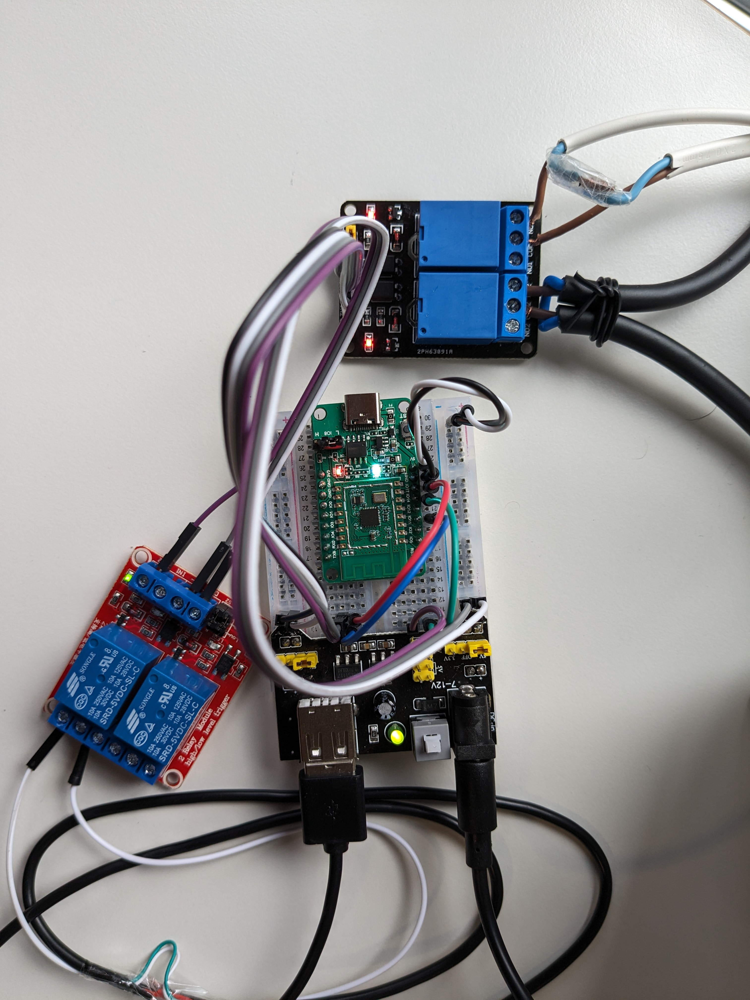
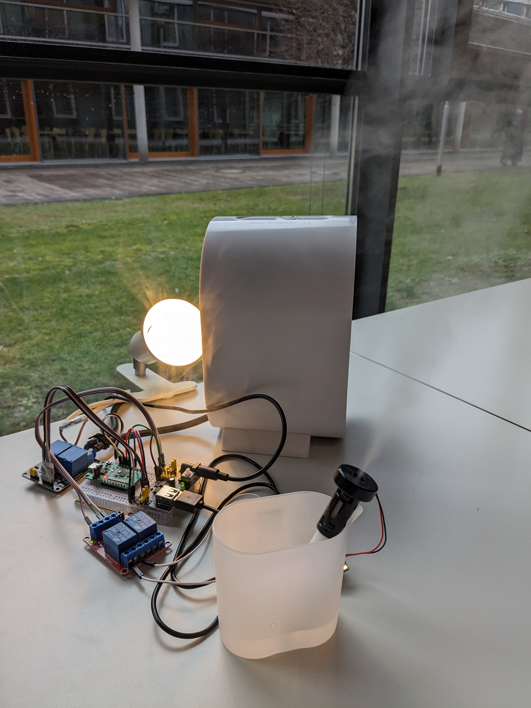
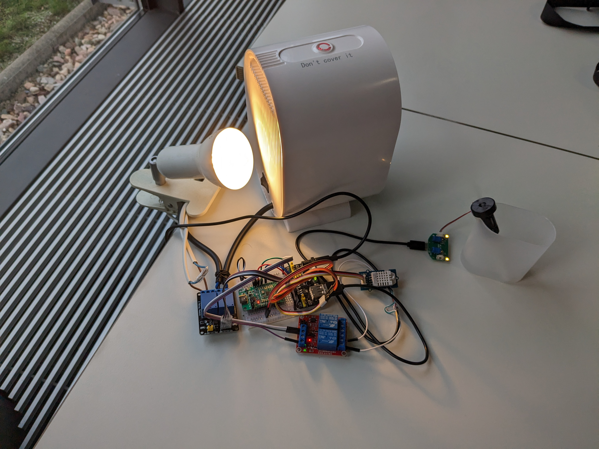
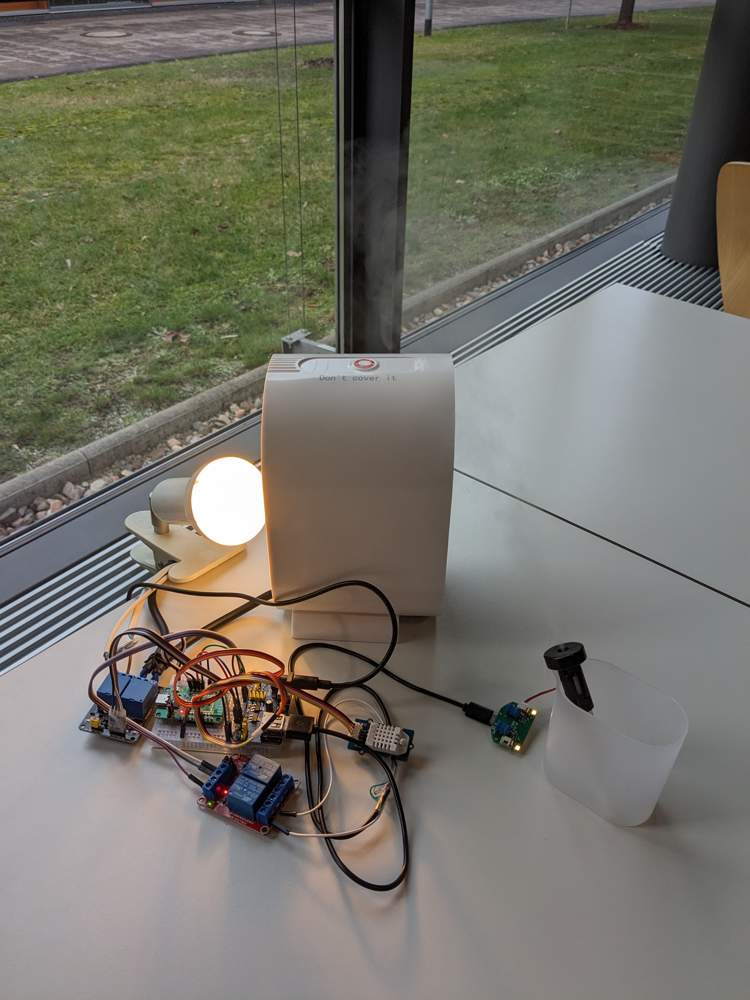

# [AmbientIQ: Smart Home Controller with Pinecorn](https://ambientiq.dorik.io/) Android App  📱
 

AmbientIQ : A Sophisticated Smart Room Ecosystem for Ultimate Comfort and Efficiency. Our prototype addresses the critical role of indoor climate control in maintaining the well-being of individuals, particularly those vulnerable to health issues stemming from insufficient humidity and tempera- ture levels. At its core, our system features a DHT22 sensor, a micro-controller [Pinecone](https://wiki.pine64.org/wiki/PineCone#PineCone_BL602_EVB_information_and_schematics), relay switches, and wireless control options. The humidity sensor accurately monitors and controls humidity levels, while the temperature sensor finds the current temperature. In order to capture various signals from different sensors, the microcontroller[Pinecone](https://wiki.pine64.org/wiki/PineCone#PineCone_BL602_EVB_information_and_schematics), processes data and adjusts the heating device and humidifier accord- ing to user preferences. Android application will be used as a user interaction point with the system, where users can set convenient temperature and humidity levels and monitor the temperature and humidity range. An Android app that is connected to a microcontroller via WiFi provides realtime information about current temperature and humidity levels. The app also enables users to make decisions about balancing settings for their comfort and health

Key Features:
=====

+ ✏️ [Manual Control:]() Connected devices like Light, Heater, Humidifigher and so one can be controlled manually.

+ 🌟 [Automation:]() User can set temperature and humidity parameter through the app. If the Temperature is below, the heater will autometically turned on and if the heat in the room reach target temparature the the heater will auto matically turned off. And the same goes for humidity and humidifigher.
  
+ 🌟 [User-Friendly:]() The app's clean and user-friendly design ensures a seamless experience, making it suitable for users of all ages.
    
Pinecone
=======
[PineCone](https://pine64.com/product/pinecone-bl602-evaluation-board/) BL602 Evaluation Board(EVB). It is based on the BL602 SoC and has a 32-bit RISC-V microprocessor, 276kB RAM and 128kB ROM.It is an open- source IoT development board with builtin USB to Serial, PCB antenna, and USB-C connection. It supports Bluetooth Low Energy 5.0 and 2.4 GHz Wi-Fi. Also it offers 2MB Flash for pro- totyping IoT projects and features onboard LEDs, en- abling communication with the web application for real- time data visualization and notification delivery.

## Project Preview

|  |   | |
| ---------------------------------------------- | -------------------------------------------- | ------------------------------------------- | 

|  |  |  |
| ------------------------------------------- | ------------------------------------------- | ------------------------------------------- |

Android Build
=====
>compileSdk 33  
>minSdk 24  
>targetSdk 33  

    
Permissions
=======    
    
    android.permission.ACCESS_COARSE_LOCATION
    android.permission.ACCESS_WIFI_STATE
    android.permission.CHANGE_WIFI_STATE
    android.permission.CHANGE_NETWORK_STATE
    android.permission.INTERNET
    android.permission.ACCESS_NETWORK_STATE
    android.permission.NEARBY_WIFI_DEVICES" android:usesPermissionFlags="neverForLocation"
    android.permission.ACCESS_FINE_LOCATION" android:maxSdkVersion="34"

Manifest
=======    
    <application
    .
        android:supportsRtl="true"
        android:usesCleartextTraffic="true"
    >
        .
    </application>

User Data Collection
=======
The app does not collect any user data.

[Download]()
========
Download AmbientIQ now and take controll of your room's ecosystem. Make your life easy and comfortable.

License
=======

# [Privacy Policy](https://sites.google.com/view/trinkbrunnen-privacy-policy/home)

If you choose to use my Service, then you agree to the collection and use of information in relation to this policy. The Personal Information that I collect is used for providing and improving the Service. I will not use or share your information with anyone except as described in this Privacy Policy. Further Details can be found [here]()

## Development version :hammer:
*   [APK (direct download)]()

## Support :rescue\_worker\_helmet:

If you need assistance or want to ask a question about the Android app, you are welcome to [ask for support](mailto:to.nazmos.sakib@gmail.com) in our Forums. If you have found a bug, feel free to [open a new Issue on GitHub](). Keep in mind, that this repository only manages the Android app. 

## Remarks :scroll:

Google Play and the Google Play logo are trademarks of Google Inc.
    
